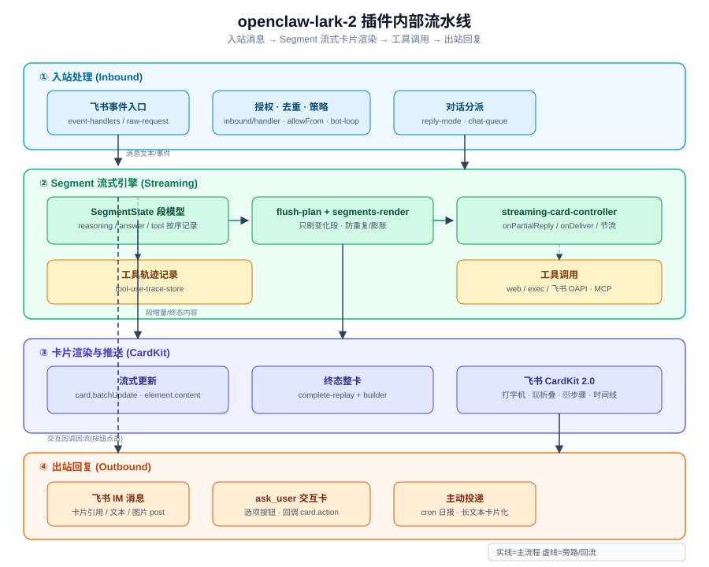
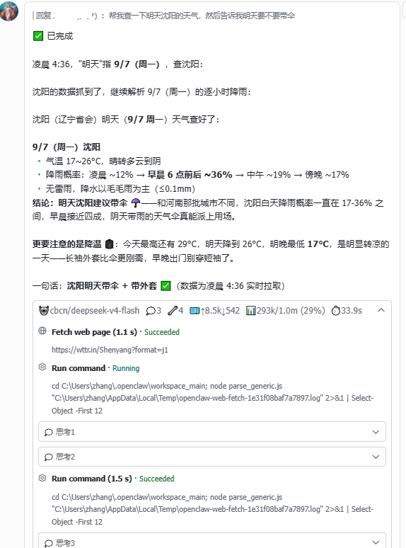

# openclaw-lark-2

**OpenClaw 2.0（2026.8.1+）专属飞书 / Lark 渠道插件** · An OpenClaw 2.0 (2026.8.1+) Feishu/Lark channel plugin, adapted from `@larksuite/openclaw-lark`.

> 🧑‍💻 OpenClaw 2.0 适配 by [@mirr0ch1](https://github.com/mirr0ch1)（[Mirr0ch1/openclaw-lark-2](https://github.com/Mirr0ch1/openclaw-lark-2)）
> 🎨 流式卡片样式参考 [hermes-fry-cards](https://github.com/techysy/hermes-fry-cards) by [@techysy](https://github.com/techysy)

上游 `@larksuite/openclaw-lark` 未跟进 OpenClaw 2.0 的 SDK 重构（导入路径、SQLite 迁移），导致无法加载、卡片指标丢失。本插件针对 2.0 全面适配，开箱即用。 / Fully adapted to the OpenClaw 2.0 SDK — the upstream `@larksuite/openclaw-lark` no longer loads on 2.0.

---

## 特性 / Features

- **流式卡片**：打字机逐字打印，`✅/❌/⏹️` 状态行永远在答案第一行；思考/工具收进单一底部折叠面板，标题一行展示运行指标，展开后按真实顺序展示工作流时间线（`💭 思考1` → 🔧 工具 → `💭 思考2` → …，思考块可再展开）。思考/工具进行中默认折叠，不打扰阅读 / Streaming cards: typewriter printing, status line on top, one bottom collapsible panel holding the real workflow timeline (thinking blocks expandable)
- **面板常驻 + 计数常显**：`showReasoning`/`showTools` 任一开启即渲染面板，标题恒带真实计数 `💭N 🔧N`（没有就是 0，展开提示"暂无思考与工具调用过程"）；双 false 则面板消失，退化为纯指标行 / Always-on panel with live 💭N 🔧N counts (0 when none); both switches false → pure-metrics footer
- **Segment 流式引擎**：思考/回答/工具按真实到达顺序记录、增量渲染只刷变化——解决三个真实 bug：答案重复多遍、长回答超飞书卡片上限（`200860 card over max size`）、打字机错乱 / Segment-driven engine: fixed duplicate answers, card-size overflow on long replies, and typewriter glitches
- **工具调用动态展示**：流式卡片实时展示工具步骤（`channels.feishu.toolUseDisplay.enabled: false` 可关）；内置 `ask_user` 按钮卡片，群聊成员均可交互 / Live tool-activity display + interactive `ask_user` cards
- **多图合并**：一次发送 ≥2 张图合并为一条富文本 post（`multiImageMode: "sequential"` 改回逐张），任一张失败自动回退不丢图 / Multi-image merged post with automatic per-image fallback
- **群聊流式**：`replyMode.group: "streaming"` 让群聊与私聊同样流式 / Streaming cards in groups
- **完整飞书能力 + 多账号**：IM/文档/多维表格/日历/任务/表格；一个实例接多个飞书应用 / Full Lark toolset + multi-account
- **SSRF 防护 + PIN 消息操作**：出站 HTTP 全走 SDK `fetchWithSsrFGuard`；message 工具支持 `pin`/`unpin`/`list-pins` / SSRF-guarded outbound HTTP + PIN message actions
- **测试基座**：vitest 最小测试套件（`npm test`） / Minimal vitest suite

---

## 架构 / Architecture

入站消息处理 → Segment 流式卡片引擎 → CardKit 推送 → 出站回复，核心是 **SegmentState 段模型**（按真实到达顺序记录思考/回答/工具）。



---

## 界面预览 / Preview

完成态卡片：`✅ 已完成` 状态行置顶，底部折叠面板常驻，展开即工作流时间线（工具步骤与思考块交错）。



> 桌面端飞书实测（沈阳天气：Fetch → Run → 思考 1/2/3 交错）。思考/工具进行中默认折叠，点开看全文。 / Desktop Feishu screenshot (Shenyang weather query).

---

## 版本记录 / Changelog

| 版本 / Version | 日期 / Date | 说明 / Notes |
|---|---|---|
| **2026.9.7** | 2026-09-11 | 兼容 OpenClaw 2026.9.3（streaming 对象形式 + 官方 commands.allowFrom 原生免补丁思考流配置 + 衍生模型 extra_body 透传指南）+ 终态卡元素预算防 300305 爆卡 + 思考终结面板箭头修复 + 模型标识 🦐 / OpenClaw 2026.9.3 compat (object-form `streaming`, native `commands.allowFrom` zero-patch thinking guide, `extra_body` model passthrough), terminal-card element budget to prevent 300305 overflow, reasoning-panel arrow fix, 🦐 model badge |

---

## 安装 / Installation

```bash
# tarball（本机开发）/ via tarball
npm pack && openclaw plugins install openclaw-lark-2-2026.9.7.tgz

# 或从源码 / or from source
git clone https://github.com/JasonXX89/openclaw-lark-2.git
cd openclaw-lark-2
cp -r . ~/.openclaw/extensions/openclaw-lark-2   # 同步到扩展目录
# openclaw gateway restart 生效
```

---

## 配置 / Configuration

沿用 `channels.feishu` 结构 / Uses the `channels.feishu` config shape:

```json5
{
  channels: {
    feishu: {
      enabled: true,
      appId: "cli_xxx",
      appSecret: "xxx",
      // 多账号示例 / multi-account example
      accounts: {
        plaud: { appId: "cli_yyy", appSecret: "yyy", dmPolicy: "pairing" },
      },
      // 多图合并：post（默认）/ sequential（逐张）/ multi-image merge mode
      multiImageMode: "post",
      // 回复模式 / reply mode（默认 auto：私聊 streaming、群聊 static）
      // 群聊要出卡片必须显式开 group: "streaming"，否则群聊回纯文本（无卡片）
      // Group streaming requires explicit `group: "streaming"` — default is static (plain text, no card)
      replyMode: {
        group: "static",    // 群聊：static=纯文本 / streaming=流式卡片
        direct: "streaming" // 私聊：默认已 streaming，可省略
      },
      // footer 指标全开 / all footer metrics on
      footer: {
        status: true,
        elapsed: true,
        model: true,
        provider: true,
        tokens: true,
        cache: true,
        context: true,
        // 思考/工具显示开关（默认 true）/ reasoning & tool display switches (default true)
        // 任一 false 隐藏对应部分；两个都 false → 面板消失退化为纯指标行 / one false hides that part; both false → pure-metrics footer
        showReasoning: true, // 💭 思考计数与面板 / reasoning count & panel
        showTools: true,     // 🔧 工具计数与面板 / tool-use count & panel
      },
    },
  },
  plugins: {
    allow: ["openclaw-lark-2"],
  },
}
```

> 飞书应用需开通 `cardkit:card:write` 权限，流式卡片才生效。 / Enable `cardkit:card:write` on the Feishu Open Platform for streaming cards.

### 卡片交互回调（必配）

按钮无反应大多是没配卡片回传回调。在飞书开放平台 → 应用 → **「开发配置」→「事件与回调」→「回调配置」**，订阅方式选**长连接**，添加回调 **`card.action.trigger`**，然后**发布版本**。每个接入的应用都要单独配。

> 只配"接收消息"事件不够——`card.action.trigger` 是回调，不在事件列表里。 / Subscribing to message events alone is NOT enough — the card callback must be added separately.

### 群聊卡片 / Group streaming

**默认群聊不出卡片**（回复纯文本）——这是刻意设计（群聊人多、整卡刷屏打扰），不是 bug。私聊默认 `streaming` 出卡片；群聊要卡片必须显式配 `replyMode.group: "streaming"`。

```json5
channels: {
  feishu: {
    streaming: true,               // 总开关（必须 true，否则全 static）
    replyMode: {
      group: "streaming",          // ← 群聊出流式卡片
      direct: "streaming",         // 私聊（默认已是 streaming，可省略）
    },
    // 按账号独立控制：账号级覆盖顶层，互不影响
    accounts: {
      botA: { appId: "cli_a", replyMode: { group: "streaming" } }, // 仅 botA 群聊出卡片
      botB: { appId: "cli_b" },                                     // botB 群聊保持 static
    },
  },
}
```

| 配置 | 效果 |
|---|---|
| 不配 `replyMode`（或 `auto`） | 私聊 `streaming`、群聊 `static`（默认） |
| `replyMode.group: "streaming"` | 群聊也出流式卡片 |
| `replyMode.group: "static"` | 显式关掉群聊卡片 |
| 账号级 `replyMode` | 只影响该账号，覆盖顶层默认 |

> ⚠️ 要用**对象形式** `{ group, direct }` 才能分别控制群聊/私聊；写字符串 `replyMode: "streaming"` 会让群聊私聊一起变 streaming。 / Use the object form to control group vs direct separately; a bare string applies to both.
> 群聊出卡片仍需机器人被 @ / 命中 allowFrom 才会回复，见上方 `groups` 配置。

---

## 可选补丁：让思考面板对普通消息生效（Reasoning hook patch）

想让飞书卡片出现 💭 面板、又不想每条消息手动带 `/reasoning stream`？装这个可选补丁。

### 现象 / 原因

OpenClaw 主程序 dist 有一道**授权 gate**：普通消息（不带指令）会把 `resolvedReasoningLevel` 压成 `"off"`，推理流根本不发给插件——即使模型在思考、`reasoningDefault` 已设 `"stream"`。这是主程序行为，**插件配置层绕不过**，只能补丁 OpenClaw 本体。

### 原理与推荐方案

在 OpenClaw 2026.9.3+ 中，官方提供了原生的授权机制。**推荐优先使用原生配置，无需安装任何补丁**：

#### 方案 A：官方原生配置（推荐，升级永不失效）

只需在 `~/.openclaw/openclaw.json` 的顶层 `commands` 中加入你的飞书用户 `ou_id`（或 `"*"` 通配）：

```json5
"commands": {
  "native": "auto",
  "nativeSkills": "auto",
  "restart": true,
  "allowFrom": {
    "feishu": [
      "ou_xxxxxx" // 填入你的飞书 open_id（支持多账号，也可直接填 "*"）
    ]
  }
}
```

配置后重启网关 `openclaw gateway restart`，发送者即可获得原生授权，思考流对普通消息直接生效。

> 💡 **排坑技巧：为什么配了授权卡片依然不显示思考？（第三方/兼容模型必备）**
> 
> 卡片展示思考流需要两个环节同时就绪：
> 1. **系统门禁放行**：通过上方的 `commands.allowFrom.feishu` 放行（日志/数据库中显示 `reasoningLevel: 'stream'`）；
> 2. **模型产生思考**：模型 API 必须在实际流式响应中输出 `reasoning_content`。
> 
> **注意**：部分第三方或代理模型（如 `cbcn/deepseek-v4.1-flash`）裸请求默认不思考，而 OpenClaw 内置白名单（只认 `deepseek-v4-flash` 和 `pro`）无法自动识别带有小版本号的模型。如果直接在 `models.providers` 填写 `params`，OpenClaw 会静默过滤丢弃。
> 
> **正确解法**：在 `openclaw.json` 的 `agents.defaults.models` 下通过 `extra_body` 显式强制透传：
> ```json5
> "agents": {
>   "defaults": {
>     "models": {
>       "10router/cbcn/deepseek-v4.1-flash": {
>         "params": {
>           "extra_body": {
>             "reasoning_effort": "medium" // 强制模型开启并输出思考流
>           }
>         }
>       }
>     }
>   }
> }
> ```

#### 方案 B：Node ESM loader hook 补丁（旧版本 OpenClaw 备用）

若使用的 OpenClaw 版本较低未支持 `commands.allowFrom`，可使用项目自带的 Hook 补丁：
`scripts/reasoning-hook.js` 借助 Node ESM loader hook 在内存中解除 gate。

### 安装顺序（仅方案 B 补丁需要）

```text
① 先装 lark-2 插件（卡片能力本体）→ 重启 gateway
② 再装 reasoning hook 补丁（可选增强）→ 重启 gateway
```

② 必须在 ① 后：补丁脚本要把 hook 复制到**运行区插件的 `scripts/`**——插件不在运行区时报"未找到插件运行目录"。

**装 / 不装效果对比**（同一配置：`reasoningDefault: "stream"` + `showReasoning: true`）：

| 场景 | 💭 思考面板 | 🔧 工具面板 |
|---|---|---|
| 只装插件 | 手动 `/reasoning stream` 才显示 | ✅ 正常 |
| 插件 + 补丁 | ✅ 普通消息也显示 | ✅ 正常 |

**一句话**：插件=必需，补丁=可选增强（让思考流默认开启）。

### 前置条件（三层缺一不可）

```text
[主程序] reasoningDefault: "stream"   ← 模型是否产生思考流
        ↓ gate（默认压 off，本补丁解除）
[补丁]   reasoning-hook               ← 思考流是否推给插件
        ↓
[插件]   footer.showReasoning: true   ← 插件是否显示 💭 面板
```

| 层 | 条件 | 检查方法 |
|---|---|---|
| ① 主程序 | Node ≥ 22.15 | `node --version` |
| ① 主程序 | `agents.entries.<agent>.reasoningDefault = "stream"` | `openclaw.json` |
| ② 补丁 | 插件已装到 `~/.openclaw/extensions/` | `ls ~/.openclaw/extensions/` |
| ③ 插件 | `footer.showReasoning` ≠ `false`（默认 true） | `openclaw.json` |

> Linux/macOS：本脚本只支持 Windows `gateway.cmd`，请手动在启动命令加 `--import "file:///绝对路径/scripts/reasoning-hook.js"`。

### 安装

脚本按自身位置找插件运行区，不依赖 cwd。推荐在运行区执行：

```bash
cd ~/.openclaw/extensions/openclaw-lark-2     # 先 ls 确认实际目录名
node scripts/install-reasoning-hook.js status # ① 看状态
node scripts/install-reasoning-hook.js install # ② 安装（幂等，重复执行安全）
openclaw gateway restart                       # ③ 重启生效
```

### 验证

1. 日志 `%TEMP%/openclaw/openclaw-*.log` 出现 `[reasoning-hook] registered (ESM loader)`
2. `node scripts/install-reasoning-hook.js status` → `gateway.cmd 含 --import hook: 是 (生效)`
3. 飞书发一条**不带** `/reasoning stream` 的思考题 → 卡片出现 💭 面板

### 卸载

```bash
node scripts/install-reasoning-hook.js uninstall && openclaw gateway restart
```

### FAQ

| 现象 | 原因 / 解决 |
|---|---|
| 日志没有 `[reasoning-hook] registered` | 没重启；或启动命令没带 `--import`（跑 status 确认） |
| 装了补丁仍不显示 💭 | ① 没配 `reasoningDefault: "stream"` ② 模型本身不产生思考 ③ `footer.showReasoning` 设了 `false` |
| `npm update -g openclaw` 后要重装吗 | 不用。内存注入、磁盘原版，升级后依然生效 |
| 影响安全吗 | 只放开"思考流是否推给插件"，不改模型行为/权限边界。单人自用风险≈0；多用户场景自行评估 |

> Optional patch — reasoning panels on plain messages without `/reasoning stream` every time. Windows `gateway.cmd` only. Install order: plugin first, then this patch.

---

## 开发 / Development

```bash
npm install        # 含 vitest
npm test           # vitest 测试套件
npm run test:watch # 监听模式
```

插件是 CommonJS（`src/` + `index.js`），无构建步骤——改动后同步到 OpenClaw 扩展目录并重启 gateway 即可。 / CommonJS source, no build step — sync and restart.

---

## 许可 — License

基于以下 MIT 项目二次开发，原版权声明保留 / Adapted from these MIT-licensed projects (original copyrights retained):

- [larksuite/openclaw-lark](https://github.com/larksuite/openclaw-lark) — 飞书官方 / official Feishu plugin
- [Mirr0ch1/openclaw-lark-2](https://github.com/Mirr0ch1/openclaw-lark-2) — OpenClaw 2.0 适配版 / 2.0 adaptation
- [techysy/hermes-fry-cards](https://github.com/techysy/hermes-fry-cards) — 流式卡片样式参考 / streaming-card style reference
