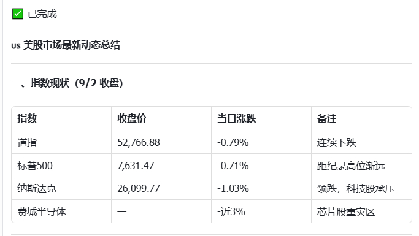
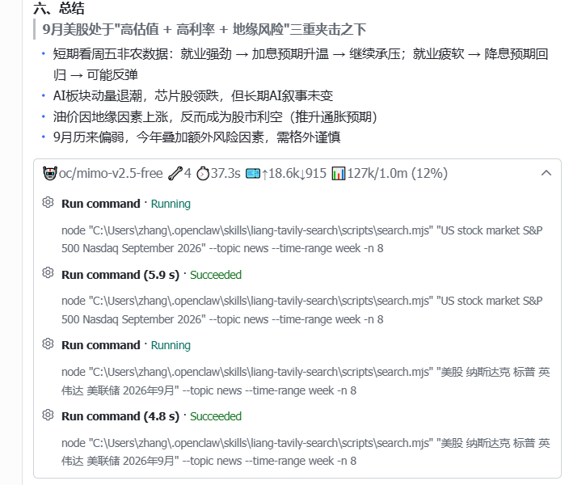

# openclaw-lark-2

**OpenClaw 2.0（2026.8.1+）专属飞书 / Lark 渠道插件** · An OpenClaw 2.0 (2026.8.1+) Feishu / Lark channel plugin, adapted from `@larksuite/openclaw-lark`.

> 🧑‍💻 OpenClaw 2.0 适配 by [@mirr0ch1](https://github.com/mirr0ch1)（[Mirr0ch1/openclaw-lark-2](https://github.com/Mirr0ch1/openclaw-lark-2)）· OpenClaw 2.0 adaptation by [@mirr0ch1](https://github.com/mirr0ch1) ([Mirr0ch1/openclaw-lark-2](https://github.com/Mirr0ch1/openclaw-lark-2))
> 🎨 流式卡片样式参考 [hermes-fry-cards](https://github.com/techysy/hermes-fry-cards) by [@techysy](https://github.com/techysy) · Streaming-card style reference: [hermes-fry-cards](https://github.com/techysy/hermes-fry-cards) by [@techysy](https://github.com/techysy)

> **背景 / Background**
>
> OpenClaw 2.0（2026.8.1）重构了插件 SDK：移除了裸 `openclaw/plugin-sdk` 导出、重命名了多个子路径、session 存储从 JSON 迁移到 SQLite。上游 `@larksuite/openclaw-lark` 未跟进，导致在 2.0 下无法加载、卡片 footer 指标消失。本插件针对 2.0 SDK 全面适配，开箱即用。
>
> OpenClaw 2.0 (2026.8.1) reworked the plugin SDK: removed the bare `openclaw/plugin-sdk` export, renamed several subpaths, and migrated session storage from JSON to SQLite. The upstream `@larksuite/openclaw-lark` did not follow up, so it fails to load on 2.0 and loses card footer metrics. This plugin is fully adapted to the 2.0 SDK — plug and play.

---

## 特性 / Features

- **OpenClaw 2.0 原生适配**：SDK 导入路径 / 类型 / 运行时 API 全部对齐 2026.8.1 / Native 2.0 adaptation: SDK import paths, types, and runtime APIs aligned with 2026.8.1
- **飞书 / Lark 全量能力**：IM 消息（含 CardKit 流式卡片）、文档（doc/wiki/drive）、多维表格（bitable）、日历、任务、电子表格等 / Full Feishu/Lark capabilities: IM messages (incl. CardKit streaming cards), docs (doc/wiki/drive), bitable, calendar, tasks, sheets, and more
- **流式卡片体验优化**：打字机逐字打印（`streaming_config: print_frequency_ms 15 + print_strategy fast`），答案置顶、`✅/❌/⏹️` 状态行永远在答案第一行；思考与工具调用收纳到单一底部折叠面板，面板标题一行内展示全部运行指标，**展开后按真实发生顺序展示工作流时间线**（`💭 思考1` → 🔧 工具步骤 → `💭 思考2` → …，思考块可再展开看全文） / Polished streaming cards: typewriter-style printing, answer on top with a `✅/❌/⏹️` status line always first; reasoning & tool-calls folded into one bottom collapsible panel whose title carries all runtime metrics in one line; **expanding reveals the real workflow timeline** (`💭 Thinking 1` → tool steps → `💭 Thinking 2` → …, each thinking block expandable for full text)
- **思考/工具显示开关**：`channels.feishu.footer.showReasoning` / `showTools`（默认 `true`）——设 `false` 时对应面板全程隐藏，footer 退化为纯指标行（`🤖model 🎫tokens 📊context ⏱️elapsed`） / Reasoning/tool display switches: `channels.feishu.footer.showReasoning` / `showTools` (default `true`) — set `false` to hide the panel entirely and leave a pure-metrics footer
- **内置 `ask_user` 工具按钮渲染**：通用 `ask_user` 问题渲染为带选项按钮的交互卡片，点击即解析；支持"其他答案"输入框表单；群聊中所有成员均可交互 / Built-in `ask_user` button rendering: generic `ask_user` questions become interactive cards with option buttons; supports an "Other answer" input form; every group member can interact
- **工具调用动态展示**：流式卡片内实时展示 agent 正在调用的工具步骤，默认开启（`channels.feishu.toolUseDisplay.enabled: false` 可关） / Live tool-activity display inside streaming cards, on by default (disable via `channels.feishu.toolUseDisplay.enabled: false`)
- **群聊流式卡片**：`channels.feishu.replyMode.group: "streaming"` 让群聊与私聊一样使用流式卡片 / Group streaming cards: `channels.feishu.replyMode.group: "streaming"` gives groups the same streaming-card experience as DMs
- **运行指标一行内展示**：折叠面板标题浓缩 `🤖模型 💭思考次数 🔧工具步数 ⏱️耗时 🎫tokens 📊上下文用量`（emoji 紧凑样式，模型多级回退自动识别上下文窗口）/ Runtime metrics in one line: `🤖model 💭reasoning-count 🔧tool-count ⏱️elapsed 🎫tokens 📊context-usage` (compact emoji style; context window auto-resolved with multi-provider fallback)
- **多图合并为一条富文本 post**：模型一次发送 ≥2 张图片时默认合并为**一条** post 消息（飞书无相册 API，每张图一个段落）；`channels.feishu.multiImageMode: "sequential"` 可改回逐张发送。任一张上传失败自动回退逐张，不丢图 / Multi-image merged post: when the model emits ≥2 images at once they merge into a **single** rich-text post by default (Feishu has no album API; one `img` paragraph per image). Set `channels.feishu.multiImageMode: "sequential"` for legacy per-image sends. Any upload failure falls back to per-image sends — nothing is lost.
- **SSRF 防护**：所有出站 HTTP 请求统一走 SDK `fetchWithSsrFGuard`——DNS pinning 防 rebinding、IPv4+IPv6 私有/保留地址阻断、重定向逐跳校验、hostname 白名单 / SSRF protection: all outbound HTTP goes through the SDK `fetchWithSsrFGuard` — DNS pinning (anti-rebinding), IPv4+IPv6 private/reserved-address blocking, per-hop redirect validation, hostname allowlist
- **PIN 消息操作**：内置 message 工具新增 `pin` / `unpin` / `list-pins` / PIN message actions: `pin` / `unpin` / `list-pins` on the built-in message tool
- **测试基座**：vitest 最小测试套件（`npm test`） / Test base: a minimal vitest suite (`npm test`)
- **多账号**：一个 openclaw 实例同时接入多个飞书应用 / Multi-account: run multiple Feishu apps on a single OpenClaw instance

---

## 界面预览 / Preview

完成态卡片（`✅ 已完成` 状态行置顶、答案另起一行，折叠面板收纳工具/思考过程）：



底部折叠面板（收起态标题在一行内展示全部指标：`🤖model 💭n 🔧n ⏱️耗时 🎫tokens 📊上下文`，点击展开按工作流时间线查看思考过程与工具明细——`💭 思考1` → 🔧 工具 → `💭 思考2` → …）：



> 截图为移动端飞书效果。面板收起时标题即全部运行指标；展开后思考块（可再点开看全文）与工具步骤按真实发生顺序交错，忠实还原 agent 工作流。
> Screenshots are from Feishu mobile. The collapsed panel title shows all runtime metrics in one line; expanding reveals thinking blocks (each expandable) interleaved with tool steps in real order — the agent's actual workflow.

---

## 版本记录 / Changelog

| 版本 / Version | 日期 / Date | 说明 / Notes |
|---|---|---|
| **2026.9.6** | 2026-09-06 | 工作流时间线展开区（折叠面板展开后 `💭 思考N` 与工具步骤按真实顺序交错，思考块可展开看全文）+ Segment 流式重构（答案单段、打字机增量防平方膨胀）+ 状态行置顶 + 审计加固（reasoning 计时 ×1000 修复、SSRF、ACL、日志脱敏等）+ reasoning hook 可选补丁（思考面板对普通消息生效）/ Workflow-timeline expansion (thinking blocks interleaved with tool steps in real order) + Segment streaming refactor (single answer segment, anti-blowup deltas) + status line on top + audit hardening + optional reasoning-hook patch |
| **2026.9.4** | 2026-09-03 | 多图合并为一条富文本 post：`channels.feishu.multiImageMode`（默认 `post`，`sequential` 回退逐张；任一上传失败自动回退）+ 卡片样式重构（答案置顶、思考/工具收单一折叠面板、指标并入标题 `🤖mimo 💭n 🔧n ⏱️… 🎫… 📊…`、上下文窗口跨 provider 自动识别）/ Merged multi-image post + card style rework (multiImageMode; answer on top, unified collapsible panel, metrics inlined into title; multi-provider context-window auto-resolution) |

---

## 安装 / Installation

### 通过 tarball（本机开发）/ via tarball (local dev)

```bash
npm pack
openclaw plugins install openclaw-lark-2-2026.9.6.tgz
```

### 从源码 / from source

```bash
git clone https://github.com/JasonXX89/openclaw-lark-2.git
cd openclaw-lark-2
# 将整个目录同步（复制）到 OpenClaw 扩展目录，例如：
# cp -r . ~/.openclaw/extensions/openclaw-lark-2
# 然后重启 OpenClaw gateway 生效
```

---

## 配置 / Configuration

插件注册 `feishu` 渠道，沿用 `channels.feishu` 配置结构 / The plugin registers the `feishu` channel using the `channels.feishu` config shape:

```json5
{
  channels: {
    feishu: {
      enabled: true,
      appId: "cli_xxx",
      appSecret: "xxx",
      // 多账号示例 / multi-account example
      accounts: {
        plaud: { appId: "cli_yyy", appSecret: "yyy", dmPolicy: "pairing" },
      },
      // 多图合并：post（默认，一次发多条图为一条）/ sequential（逐张发送）
      // multi-image: "post" (default, merge ≥2 images into one rich-text post)
      //              | "sequential" (legacy per-image sends)
      multiImageMode: "post",
      // footer 七项全开 / all 7 footer metrics on
      footer: {
        status: true,
        elapsed: true,
        model: true,
        provider: true,
        tokens: true,
        cache: true,
        context: true,
        // 思考/工具显示开关（默认 true）：false 时对应面板全程隐藏，
        // footer 退化为纯指标行 / reasoning & tool panel visibility
        // (default true); false hides the panel → pure-metrics footer
        showReasoning: true,
        showTools: true,
      },
    },
  },
  plugins: {
    allow: ["openclaw-lark-2"],
  },
}
```

> 提示：飞书应用需在开放平台开通 `cardkit:card:write` 权限，流式卡片才能生效。
> Tip: the Feishu app needs the `cardkit:card:write` scope enabled in the Open Platform for streaming cards to work.

### 卡片交互回调（必配）

**卡片按钮点击无反应？** 大多是没在飞书开放平台添加卡片回传交互回调。以下两类功能依赖它：

- `ask_user` 选项按钮卡片（用户点选项/提交自定义答案）
- 卡片上的操作按钮（如 auto-auth 授权引导）

**每个接入的应用都要单独配置**（多账号场景需逐个配）：

1. 打开 [飞书开放平台](https://open.feishu.cn/app) → 进入目标应用
2. 左侧 **「开发配置」→「事件与回调」**
3. 切到 **「回调配置」** 标签页（注意不是「事件配置」——`card.action.trigger` 是回调，不在事件列表里）
4. 订阅方式选 **「使用长连接接收事件」**（本插件默认 WebSocket 长连接）
5. 点 **「添加回调」** → 搜索 **`card.action.trigger`**（卡片回传交互）→ 添加
6. **「发布版本」** 让配置生效

> 提醒：只配置了"接收消息"事件不足以让按钮工作——卡片回传交互回调必须单独添加。
> Tip: subscribing to message-receive events alone is NOT enough — the card callback interaction (`card.action.trigger`) must be added separately for buttons to respond.

---

## 可选补丁：让思考面板对普通消息生效（Reasoning hook patch）

> **这个补丁是给谁用的**：想让飞书卡片出现 💭 思考面板、但**不想每条消息都手动带 `/reasoning stream`** 的人。
> 插件本身不带思考面板门控——它只是忠实显示 OpenClaw 推过来的推理流；OpenClaw 是否推，取决于下面的 gate。

### 1. 现象 / 问题

OpenClaw 默认在**普通消息**（不带 `/reasoning stream` 指令）时**不把思考流推给渠道插件**——即使：
- 模型实际在思考（`deepseek-reasoner` 这类推理模型、或配了 thinking 的模型）
- `openclaw.json` 里已设 `reasoningDefault: "stream"`

结果：飞书卡片**只有工具调用、没有 💭 思考面板**。必须每条消息手动加 `/reasoning stream` 才出思考。

### 2. 原因（为什么插件自己解决不了）

OpenClaw 主程序 dist 里有一道**授权 gate**：非授权发送者的普通消息会把 `resolvedReasoningLevel` 强制压成 `"off"`，于是推理流根本不发到插件。这是 OpenClaw 主程序行为——**在插件配置层无法绕过**，只能补丁 OpenClaw 本体。

### 3. 补丁原理（读一下，理解它干了什么）

`scripts/reasoning-hook.js` 是一个 **Node ESM loader hook**（`module.registerHooks`，要求 Node 22.15+ / 23+）：
- 在 OpenClaw 加载 `dist/get-reply-*.js` 的**内存阶段**，把那行 `if (reasoningUsesConfiguredDefault && !canUseReasoningState) resolvedReasoningLevel = "off";` 替换成注释
- **磁盘上的 dist 文件保持原版** → `npm update -g openclaw`、重新安装都**不会冲掉**（hook 按 `get-reply-*.js` 文件名匹配，不依赖具体 hash，OpenClaw 升级后依然生效）
- 安装脚本自动往 `~/.openclaw/gateway.cmd` 的 node 启动行插入 `--import "file:///.../reasoning-hook.js"`，让 gateway 每次启动都加载 hook

### 4. 前置条件（先确认，缺一不可）

| 条件 | 检查方法 |
|---|---|
| Node ≥ 22.15 | `node --version` |
| 插件已安装到运行区 | `~/.openclaw/extensions/` 下能找到本插件目录 |
| OpenClaw 以 gateway 模式运行（Windows 计划任务/`gateway.cmd`） | 存在 `~/.openclaw/gateway.cmd` |
| 目标 agent 已开流式思考 | `openclaw.json` → `agents.entries.<agent>.reasoningDefault = "stream"` |

> Linux/macOS 用户：gateway 启动命令不同（不是 `gateway.cmd`），本脚本只支持 Windows gateway.cmd。请手动在启动命令加 `--import "file:///绝对路径/scripts/reasoning-hook.js"`。

### 5. 安装（在插件仓库根目录执行）

```bash
# ① 先看当前状态（建议先跑）
node scripts/install-reasoning-hook.js status

# ② 安装：复制 hook 到运行区 + 给 gateway.cmd 加 --import
node scripts/install-reasoning-hook.js install

# ③ 重启网关（让 --import 生效）
openclaw gateway restart
```

脚本是**幂等**的：重复 install 不会重复加 `--import`；gateway.cmd 已含时自动跳过。

### 6. 验证是否生效（三步）

1. **看日志**：`%TEMP%/openclaw/openclaw-*.log` 里应出现
   `[reasoning-hook] registered (ESM loader)`；首次加载 get-reply 时还会出现
   `[reasoning-hook] patched get-reply-*.js (in-memory)`
2. **跑 status**：`node scripts/install-reasoning-hook.js status` → `gateway.cmd 含 --import hook: 是 (生效)`
3. **发消息实测**：飞书发一条**不带** `/reasoning stream` 的思考题（如"1+2+…+100 等于多少？请一步步推理"）→ 卡片出现 💭 面板即生效

### 7. 卸载 / 回滚

```bash
node scripts/install-reasoning-hook.js uninstall   # 移除 --import + 删 hook 文件
openclaw gateway restart                            # 重启生效
```

### 8. 常见问题 FAQ

| 现象 | 原因 / 解决 |
|---|---|
| 日志没有 `[reasoning-hook] registered` | gateway 没重启；或启动命令没带 `--import`（跑 `status` 看 `含 --import hook` 是否为"是"） |
| 装了补丁仍不显示 💭 | ① agent 没配 `reasoningDefault: "stream"` ② 模型本身不产生思考（如纯文本模型） ③ `channels.feishu.footer.showReasoning` 设了 `false`（那是插件显示层开关，见下方说明） |
| `npm update -g openclaw` 后要重装吗 | **不用**。hook 在内存注入，磁盘 dist 原版，升级后依然生效 |
| 影响安全吗 | 仅把"思考流是否推给插件"放开，不改模型行为/权限边界。单人自用风险≈0；多用户场景需自行评估（思考内容会经渠道插件展示） |
| 和 `showReasoning` 开关什么关系 | 两层串行：本补丁管**上游**（OpenClaw 是否推思考流）；`footer.showReasoning` 管**下游**（插件是否显示）。两个都"开"才有 💭 面板 |

### 9. 与插件配置的关系（重要）

- 补丁只解决"思考流能不能推到插件"
- 推过来之后**显不显示**，由插件配置决定：
  ```json5
  channels.feishu.footer: {
    showReasoning: true,   // false = 收到思考流也丢弃，不显示 💭 面板
    showTools: true,       // false = 不显示 🔧 工具面板
  }
  ```
  想要 💭 面板 = 补丁(推) + `showReasoning: true`(显示) 缺一不可。

> Optional patch: reasoning panel for plain messages without appending `/reasoning stream` every time. Install only if you want 💭 panels on ordinary messages. Windows gateway.cmd only.

---

## 开发 / Development

```bash
npm install            # 安装依赖（含 vitest）/ install deps (incl. vitest)
npm test               # 运行 vitest 测试套件 / run the vitest test suite
npm run test:watch     # 测试监听模式 / watch mode
```

插件为 CommonJS 源码（`src/` + `index.js` 入口），无需构建步骤，改动后同步到 OpenClaw 扩展目录并重启网关即可生效。

The plugin is CommonJS source (`src/` + `index.js` entry) with no build step — sync to the OpenClaw extensions directory and restart the gateway to apply changes.

---

## 许可 — License

基于以下项目二次开发，均采用 MIT 许可：

- [larksuite/openclaw-lark](https://github.com/larksuite/openclaw-lark) — 飞书官方出品
- [Mirr0ch1/openclaw-lark-2](https://github.com/Mirr0ch1/openclaw-lark-2) — OpenClaw 2.0 适配版
- [techysy/hermes-fry-cards](https://github.com/techysy/hermes-fry-cards) — 流式卡片样式参考

MIT 许可及原版权声明保留。

Adapted from the following MIT-licensed projects:

- [larksuite/openclaw-lark](https://github.com/larksuite/openclaw-lark) — official Feishu/Lark plugin
- [Mirr0ch1/openclaw-lark-2](https://github.com/Mirr0ch1/openclaw-lark-2) — OpenClaw 2.0 adaptation
- [techysy/hermes-fry-cards](https://github.com/techysy/hermes-fry-cards) — streaming-card style reference

MIT licensed, original copyright notices retained.
